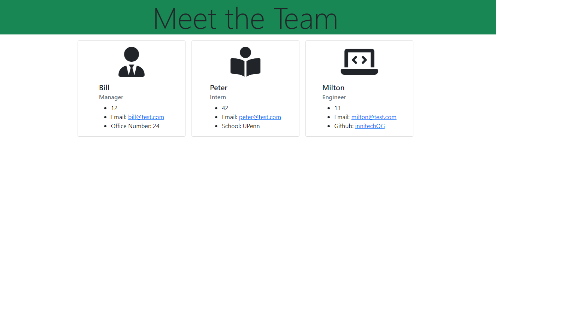
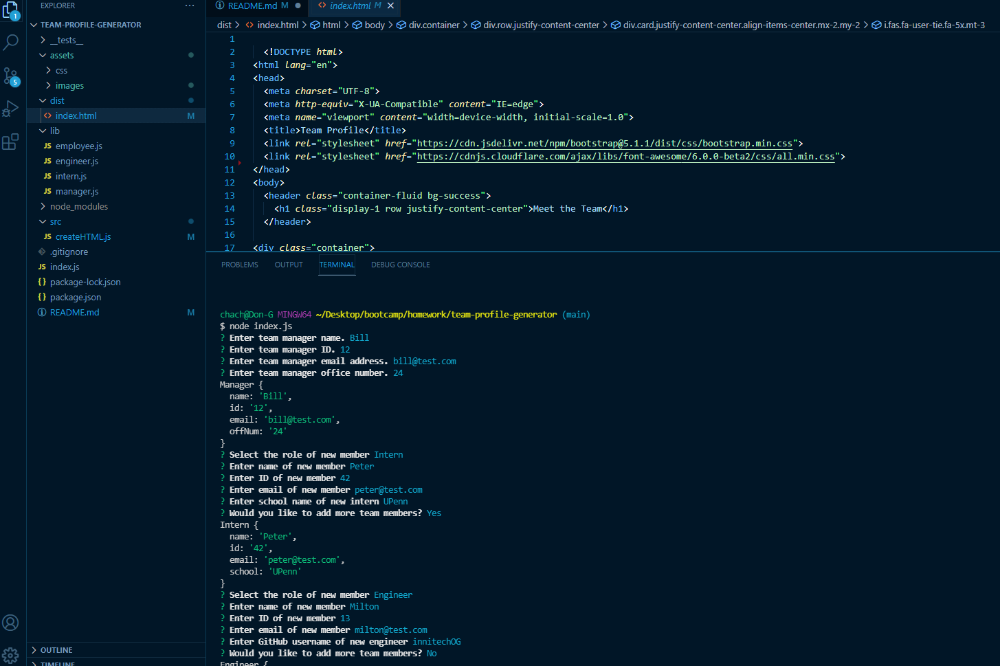

# team-profile-generator

Walkthrough Video: https://youtu.be/LOWTWfM_7RM

Repo on GitHub: https://github.com/curriecoder/team-profile-generator

## Description

This project was motivated by a desire to push myself to make a node.js application that can build a professional website via prompts. This project allows organizations to quickly manage a team profile page so that contact and background info are available at a glance. This application allows the user to maintain their team with ease.

## Installation

To use this application, you will need to install inquirer npm in your terminal. Feel free to email me with any questions (contact info on GitHub).

## Usage

This app is intended to be used as a means of constructing a team profile page with ease.

 
 

## Credits

I would first like to thank the instructors of UPenn LPS Coding Bootcamp class of 08-2021 for continually putting the students at the top of the importance list. Also, thanks to all of my classmates that helped me through this project. Big thanks to stackoverflow for being an awesome community. Also, thanks to Kyle Cook at Web Dev Simplified for making great tutorial videos that helped me make this project.

  https://www.youtube.com/channel/UCFbNIlppjAuEX4znoulh0Cw  

## License

MIT License

Copyright (c) [2021] [Andrew J. Currie]

Permission is hereby granted, free of charge, to any person obtaining a copy
of this software and associated documentation files (the "Software"), to deal
in the Software without restriction, including without limitation the rights
to use, copy, modify, merge, publish, distribute, sublicense, and/or sell
copies of the Software, and to permit persons to whom the Software is
furnished to do so, subject to the following conditions:

The above copyright notice and this permission notice shall be included in all
copies or substantial portions of the Software.

THE SOFTWARE IS PROVIDED "AS IS", WITHOUT WARRANTY OF ANY KIND, EXPRESS OR
IMPLIED, INCLUDING BUT NOT LIMITED TO THE WARRANTIES OF MERCHANTABILITY,
FITNESS FOR A PARTICULAR PURPOSE AND NONINFRINGEMENT. IN NO EVENT SHALL THE
AUTHORS OR COPYRIGHT HOLDERS BE LIABLE FOR ANY CLAIM, DAMAGES OR OTHER
LIABILITY, WHETHER IN AN ACTION OF CONTRACT, TORT OR OTHERWISE, ARISING FROM,
OUT OF OR IN CONNECTION WITH THE SOFTWARE OR THE USE OR OTHER DEALINGS IN THE
SOFTWARE.

---